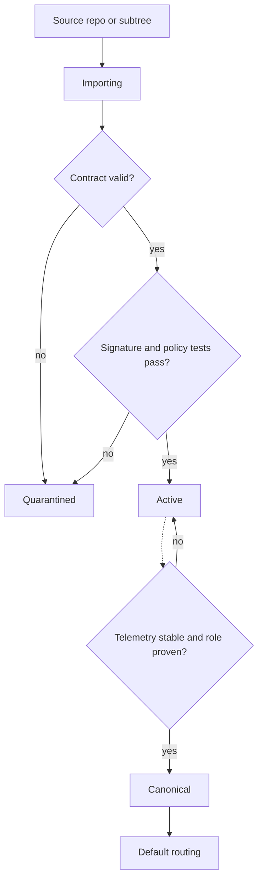

# BugBountyOS Architecture: The Security OS Frame

## Executive Summary
BugBountyOS is a **security operating system**. It governs specific routable **Vectors** without destroying their semantic identity.

- **Linux Model**: Shared build model for in-tree and out-of-tree modules.
- **OPA (Open Policy Agent)**: Decouples policy decision-making from enforcement.
- **NIST Zero Trust**: Dynamic governance via status assessments and telemetry.

## The Kernel (Constitutional Layer)

- **Kernel** Policy decision, audit eligibility, and routing authority.
- **Control Plane**: Vector registry, lifecycle states, and telemetry.
-  **Vectors**: Specialized capabilities (RedSage, ATDA, Sentinel).

## Vector Lifecycle (Traffic-Light Semantics)

| State | Color | Meaning | Default Routing |
|---|---|---|---|
 | Importing | Yellow | Ingested, not yet trusted for default execution | Manual only |
 | Active | Blue/Green | Routable under constitutional guardrails | Conditional |
 | Canonical | Green | Preferred implementation for a named function | Default |
 | Quarantined | Red | Failed policy, health, signature, or telemetry gate | Blocked |

## Promotion Flow
